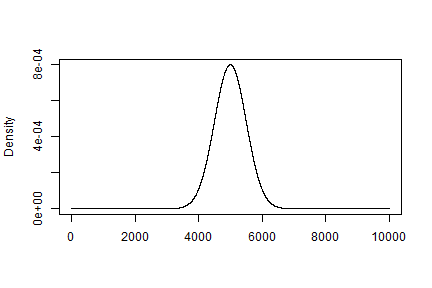
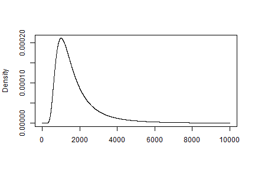

Curse of the Long Tail - Eample of t-test failure
========================================================
author: Charles Allen
date: 2016-06-25
autosize: true

Educating the public on the dangers of non-normal distributions in t-tests

t-test
========================================================

The t-test is one of the most common statistical tests performed

- Can determine if metrics from two populations differe in a statistically significant manner
- Works best with *normal* distributions
- More information available on [wikipedia](https://en.wikipedia.org/wiki/Student%27s_t-test)
- Key metric is the "t-statistic", which is relate to the difference in means devided by the standard error
- Depends on sample size

$$
t = \frac{\mu_1 - \mu_2}{\sqrt{(var_1 + var_2)/n}}
$$

Normal distribution t-test
========================================================
A simple t-test is often performed against normally distributed data of the type below:


```r
gaussian_fn <- function(x, mu, sigma) {
    dnorm(x, mean = mu, sd = sigma)
}
mu <- 5000
sigma <- 500
x <- 1:10000
```

```r
plot(x, y = gaussian_fn(x, mu, sigma), xlab = "", ylab = "Density", type = 'l')
```



t-test is optimal against this type of distribution.

Non-normal distribution
========================================================
For a distribution with a long-tail, we can use [Planck's law](https://en.wikipedia.org/wiki/Planck%27s_law). When ignoring scaling factors, this takes the general form of:

```r
planck_fn <- function(x, a) {
    y <- x
    positive = x > 0
    y[!positive] <- 0
    y[positive] <- 1/(exp(a/x[positive]) - 1) / x[positive]^5
}
x <- 1:10000
```


```r
plot(x, y = planck_fn(x / 500, 10), xlab = "", ylab = "Density", type = 'l')
```



The long-tail at higher x-values completely screws up a simple t-test, yielding results very different from visual inspection.

TTestExamples
========================================================
t-test examples are [hosted online](https://allen-net.shinyapps.io/TTestExamples/) as an educational tool and allow easy manipulation of a normal and a long-tail distribution to see the effect on the p-value (same-ness statistic) for visually simmilar distributions.

The sources for the app and this presentation are hosted on [github](https://github.com/drcrallen/TTestExamples)

For data with long-tails, t-tests often yield WRONG results when evaluating differences between to groups of data points. This can be mitigated in some circumstances by exercising the central limit theorem, and applying the t-test to the *mean* of groups of data. For example, if data is collected from various sites, taking the mean per site, then looking at the distribution of means of sites in group **A** vs sites in group **B** should yield a viable t-test.
